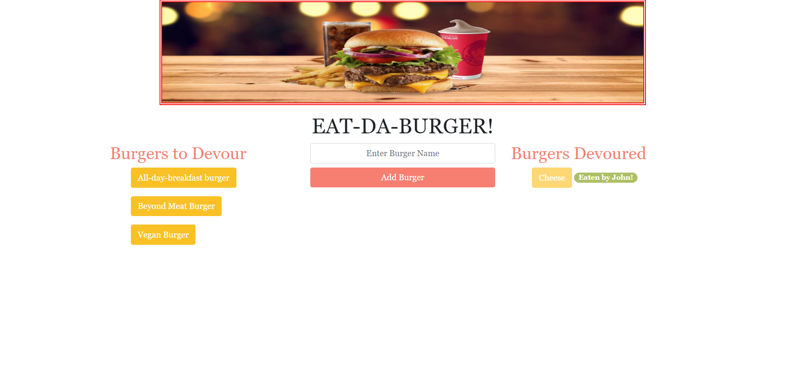

# Sequelized Burger
This is a single page webapp which demonstrates CRUD functioalilties. Users can create _burger_ entries by entering the name of a _burger_ into the text field. This creates a _burger_ entry in the `MySQL` database. Then, user can fill in the _customer_ name when they click on their newly created _burger_ and "eat" their _burger_. This creates a _customer_ entry in the `MySQL` database that is joined to the specific _burger_. 

### [Live Demo on Heroku](https://sequelize-burgernfries.herokuapp.com/burgers)

### Technologies used
---
(1) `Node/Express` are used for the server and routing.

(2) `MySQL` for the database and models. 

(3) [Sequelize](https://sequelize.org/) for ORM mapping. Sequelize is a promise-based Node.js ORM for Postgres, MySQL, MariaDB, SQLite and Microsoft SQL Server. 

(4) [`Handlebars`](https://handlebarsjs.com/) templating engine for the layout and views.

### Getting Started
---
(1) Clone this repository. 

(2) Change directory to sequelize-burger

(3) Assuming that NodeJS and MySQL are already installed on your system, install following package.json dependancies:
  
  * express
  * express-handlebars
  * method-override  
  * mysql2
  * sequelize
  
  OR execute command `npm install` 

(4) Run the server using command `node server.js`. By default server will run on port 8080, if you wish to change the port number, please set your local environment variable PORT. 

(5) Open URL http://localhost:8080 in your browser to view the app.

### Author
Click [here](https://github.com/pshegde123/sequelizedBurger/graphs/contributors) to see contribution history.
  
